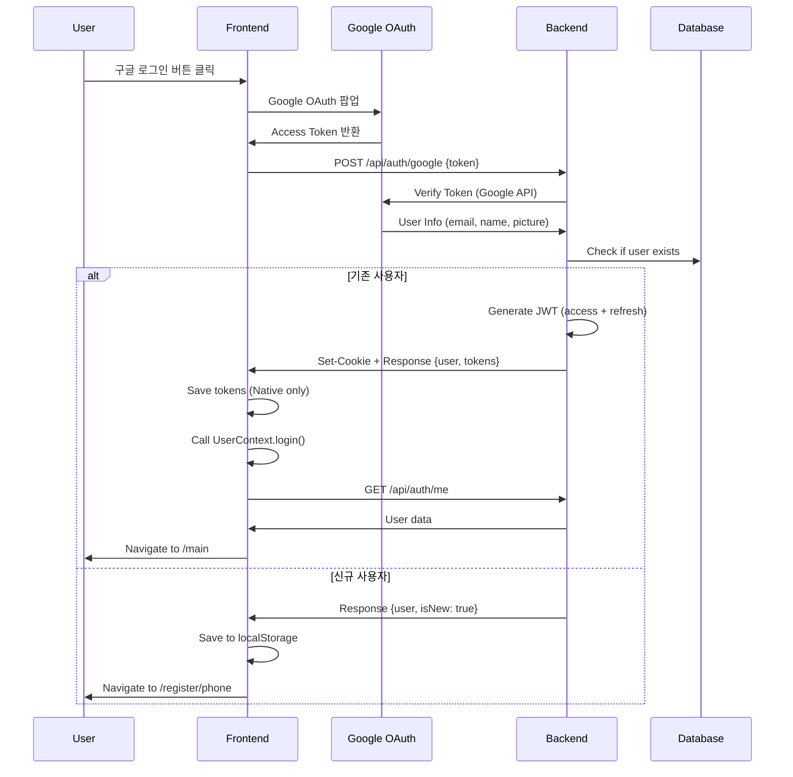
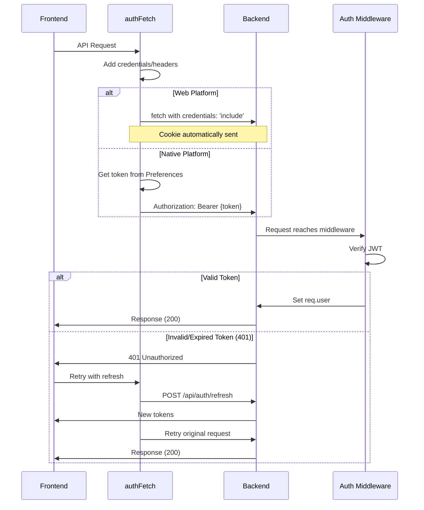
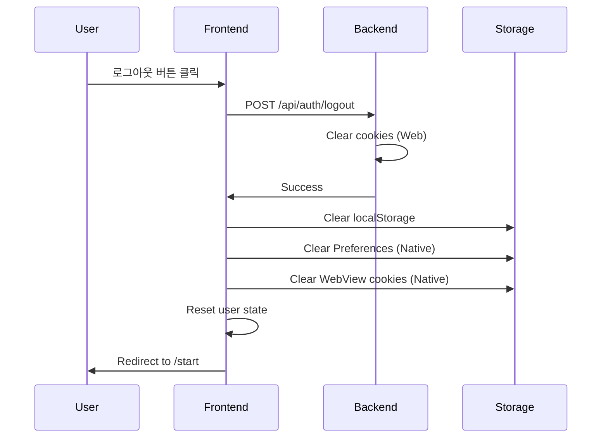

# Mimy 인증 시스템 가이드

**최종 업데이트**: 2026-02-05
**버전**: v2.0 (JWT-only)

## 목차

1. [개요](#개요)
2. [인증 아키텍처](#인증-아키텍처)
3. [인증 흐름](#인증-흐름)
4. [구현 상세](#구현-상세)
5. [보안 설정](#보안-설정)
6. [문제 해결](#문제-해결)
7. [최근 변경사항](#최근-변경사항)

---

## 개요

Mimy는 **JWT(JSON Web Token) 기반 인증 시스템**을 사용합니다.

### 핵심 특징

- **Web**: HttpOnly 쿠키 기반 JWT 인증 (XSS 방어)
- **Native (iOS/Android)**: Bearer 토큰 기반 JWT 인증
- **Google OAuth 2.0**: 소셜 로그인
- **이메일 제한**: @catchtable.co.kr 도메인 + 화이트리스트

### 토큰 종류

| 토큰 | 유효기간 | 용도 |
|------|---------|------|
| Access Token | 24시간 | API 요청 인증 |
| Refresh Token | 7일 | Access Token 갱신 |

---

## 인증 아키텍처

```
┌─────────────────────────────────────────────────────────────┐
│                    Frontend (React)                          │
├─────────────────────────────────────────────────────────────┤
│  Web Browser              │  Native App (iOS/Android)        │
│  - JWT in HttpOnly Cookie │  - JWT in Capacitor Preferences  │
│  - credentials: 'include' │  - Authorization: Bearer {token} │
└─────────────────┬───────────────────────┬───────────────────┘
                  │                       │
                  ▼                       ▼
┌─────────────────────────────────────────────────────────────┐
│              authFetch.ts (Unified API Client)               │
│  - Auto token refresh on 401                                 │
│  - Platform detection (web vs native)                        │
│  - CapacitorHttp for native, fetch for web                   │
└─────────────────────────┬───────────────────────────────────┘
                          │
                          ▼
┌─────────────────────────────────────────────────────────────┐
│                  Backend (Express.js)                        │
├─────────────────────────────────────────────────────────────┤
│  CORS Middleware                                             │
│  - credentials: true                                         │
│  - allowedHeaders: ['Content-Type', 'Authorization']         │
├─────────────────────────────────────────────────────────────┤
│  Auth Middleware (requireAuth / optionalAuth)                │
│  1. Check Authorization header (Bearer token) - Native       │
│  2. Check access_token cookie - Web                          │
│  3. Verify JWT signature                                     │
│  4. Return 401 if invalid                                    │
└─────────────────────────────────────────────────────────────┘
```

---

## 인증 흐름

### 1. 로그인 (신규/기존 사용자)



### 2. API 요청 (인증 필요)



### 3. 로그아웃



---

## 구현 상세

### Frontend

#### 1. UserContext (`src/context/UserContext.tsx`)

```typescript
// 인증 상태 관리
interface UserContextType {
  user: User | null;
  loading: boolean;
  login: (userId: string) => Promise<void>;
  logout: () => Promise<void>;
  refreshUser: () => Promise<void>;
  // ...
}
```

**주요 기능**:
- 앱 시작 시 자동 인증 체크 (`/api/auth/me`)
- 로그인/로그아웃 처리
- localStorage 정리 (로그아웃 시)

#### 2. authFetch (`src/lib/authFetch.ts`)

```typescript
// 플랫폼별 인증 요청 처리
export async function authFetch(url: string, options?: RequestInit): Promise<Response>
```

**주요 기능**:
- Web: `credentials: 'include'` 사용
- Native: `Authorization: Bearer {token}` 헤더 추가
- 401 에러 시 자동 토큰 갱신
- 갱신 실패 시 `/start`로 리다이렉트

#### 3. tokenStorage (`src/lib/tokenStorage.ts`)

```typescript
// Native 앱 전용 토큰 저장소
export const saveTokens = async (accessToken: string, refreshToken: string): Promise<boolean>
export const getAccessToken = async (): Promise<string | null>
export const getRefreshToken = async (): Promise<string | null>
export const clearTokens = async (): Promise<boolean>
```

**저장 위치**: Capacitor Preferences (iOS/Android 네이티브 스토리지)

### Backend

#### 1. Auth Routes (`server/routes/auth.ts`)

```typescript
POST   /api/auth/google      // Google OAuth 로그인
POST   /api/auth/register    // 회원가입 완료
GET    /api/auth/me          // 현재 사용자 조회
POST   /api/auth/refresh     // 토큰 갱신
POST   /api/auth/logout      // 로그아웃
```

#### 2. Auth Middleware (`server/middleware/auth.ts`)

```typescript
export const requireAuth   // 인증 필수 (401 if not authenticated)
export const optionalAuth  // 인증 선택 (continue if not authenticated)
```

**인증 우선순위**:
1. `Authorization: Bearer {token}` 헤더 (Native)
2. `access_token` HttpOnly 쿠키 (Web)

#### 3. JWT Utils (`server/utils/jwt.ts`)

```typescript
export const generateAccessToken = (userId: number, email: string): string
export const generateRefreshToken = (userId: number): string
export const verifyAccessToken = (token: string): Payload | null
export const verifyRefreshToken = (token: string): Payload | null
```

**JWT 구조**:
```json
{
  "userId": 123,
  "email": "user@catchtable.co.kr",
  "iat": 1234567890,
  "exp": 1234654290
}
```

---

## 보안 설정

### 쿠키 설정 (Web)

```typescript
res.cookie('access_token', accessToken, {
  httpOnly: true,                                        // XSS 방어
  secure: process.env.NODE_ENV === 'production',        // HTTPS only (prod)
  sameSite: process.env.NODE_ENV === 'production' ? 'none' : 'lax', // CSRF 방어
  path: '/',
  maxAge: 24 * 60 * 60 * 1000  // 24시간
});
```

**보안 특징**:
- ✅ `httpOnly`: JavaScript로 접근 불가 (XSS 방어)
- ✅ `secure`: HTTPS에서만 전송 (Production)
- ✅ `sameSite`: Cross-site 요청 제한 (CSRF 방어)

### CORS 설정

```typescript
app.use(cors({
  origin: process.env.NODE_ENV === 'production'
    ? ['https://mimytest.vercel.app', 'capacitor://localhost', 'ionic://localhost']
    : ['http://localhost:5173', 'http://localhost:3000', 'capacitor://localhost'],
  credentials: true,  // 쿠키 전송 허용
  methods: ['GET', 'POST', 'PUT', 'DELETE', 'PATCH'],
  allowedHeaders: ['Content-Type', 'Authorization']
}));
```

### 환경 변수

```bash
# .env
JWT_SECRET=<256-bit random string>           # Access Token 서명 키
JWT_REFRESH_SECRET=<256-bit random string>   # Refresh Token 서명 키
NODE_ENV=development|production              # 환경 설정
```

**생성 방법**:
```bash
node -e "console.log(require('crypto').randomBytes(64).toString('base64'))"
```

---

## 문제 해결

### 1. 로그인 후 바로 로그아웃됨

**원인**: Access token 쿠키가 전송되지 않음

**해결**:
1. CORS 설정 확인: `credentials: true`
2. Frontend 요청 확인: `credentials: 'include'`
3. 쿠키 도메인 확인 (localhost vs 127.0.0.1)

```bash
# 브라우저 개발자 도구 > Application > Cookies
# access_token, refresh_token 확인
```

### 2. 401 Unauthorized 지속 발생

**원인**: JWT 검증 실패

**해결**:
1. JWT_SECRET 환경 변수 확인
2. 토큰 만료 확인 (24시간)
3. Backend 서버 재시작

```bash
# Backend 로그 확인
npm run server
# [requireAuth] 로그 확인
```

### 3. Native 앱에서 로그인 실패

**원인**: 토큰 저장 실패

**해결**:
1. Capacitor Preferences 권한 확인
2. 로그 확인: `[TokenStorage]` 태그
3. 토큰 검증:

```typescript
import { getAccessToken } from '@/lib/tokenStorage';
const token = await getAccessToken();
console.log('Token:', token ? 'Found' : 'Not found');
```

### 4. CORS 에러 (preflight)

**원인**: CORS allowedHeaders 설정 불일치

**해결**:
1. Backend CORS 설정 확인
2. Frontend 헤더 확인
3. OPTIONS 요청 응답 확인

```bash
# Network 탭에서 OPTIONS 요청 확인
# Access-Control-Allow-Headers 확인
```

### 5. Production 로그아웃 후 리로드 시 재접속

**원인**: localStorage 미정리 (v1.x 버그)

**해결**: ✅ v2.0에서 수정됨
- [UserContext.tsx:182-189](src/context/UserContext.tsx#L182-L189)에서 localStorage 정리 추가

---

## 최근 변경사항

### v2.0 (2026-02-05) - Major Security Update

#### ❌ 제거된 기능
- **x-user-id 헤더 인증 방식** (보안 취약)
  - Frontend에서 x-user-id 헤더 전송 제거
  - Backend fallback 인증 제거
  - CORS allowedHeaders에서 제거

#### ✅ 개선 사항
1. **JWT 전용 인증**
   - Web: HttpOnly 쿠키만 사용
   - Native: Bearer 토큰만 사용

2. **로그아웃 버그 수정**
   - localStorage 정리 추가
   - WebView 쿠키 클리어 강화

3. **환경 설정 명확화**
   - package.json에 NODE_ENV 명시
   - Development/Production 쿠키 설정 분리

#### 📝 Migration Guide (v1.x → v2.0)

기존 코드에서 x-user-id를 사용하는 경우:

```typescript
// ❌ Before (v1.x)
const userId = localStorage.getItem('mimy_user_id');
fetch(url, {
  headers: {
    'x-user-id': userId
  }
});

// ✅ After (v2.0)
import { authFetch } from '@/lib/authFetch';
authFetch(url);  // JWT 자동 처리
```

#### 🔧 Breaking Changes
- `x-user-id` 헤더를 사용하는 모든 코드 제거 필요
- `localStorage.getItem('mimy_user_id')` 의존성 제거 필요

---

## 참고 문서

### 코드 위치

**Frontend**:
- [src/context/UserContext.tsx](src/context/UserContext.tsx) - 인증 상태 관리
- [src/lib/authFetch.ts](src/lib/authFetch.ts) - API 클라이언트
- [src/lib/tokenStorage.ts](src/lib/tokenStorage.ts) - Native 토큰 저장소
- [src/screens/auth/LoginPage.tsx](src/screens/auth/LoginPage.tsx) - 로그인 UI

**Backend**:
- [server/routes/auth.ts](server/routes/auth.ts) - 인증 API
- [server/middleware/auth.ts](server/middleware/auth.ts) - 인증 미들웨어
- [server/utils/jwt.ts](server/utils/jwt.ts) - JWT 유틸리티
- [server/index.ts](server/index.ts) - CORS 설정

### 외부 문서
- [JWT.io](https://jwt.io/) - JWT 디버거
- [Google OAuth 2.0](https://developers.google.com/identity/protocols/oauth2)
- [Capacitor Preferences](https://capacitorjs.com/docs/apis/preferences)

---

**문서 작성자**: Claude Sonnet 4.5
**문의**: 프로젝트 이슈 트래커
